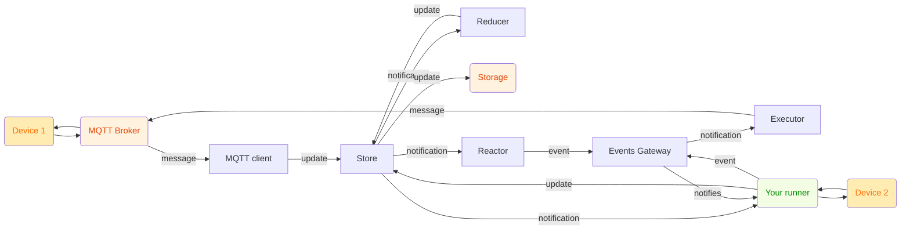

# Tinkwell: Orchestrating Modular Systems at the Edge

In today's distributed environments, from industrial IoT to lab automation, building resilient and adaptable systems presents unique challenges. Tinkwell emerges as a lightweight, configuration-driven framework designed to simplify the orchestration of modular components, particularly at the edge.

Tinkwell offers a compelling alternative for building resilient, modular applications at the edge. Its focus on configuration-driven deployment, lightweight footprint, and robust inter-process communication makes it ideal for scenarios where traditional solutions are too heavy or inflexible.

For more insights into the vision behind Tinkwell, read [Tinkwell: Firmware-less IoT and Lab Automation](https://dev.to/adriano-repetti/tinkwell-firmware-less-iot-and-lab-automation-2gef).

## The Distributed Challenge

Traditional monolithic applications often struggle with the dynamic nature of edge deployments, where connectivity can be intermittent and resources constrained. The complexities of managing diverse processes, ensuring data integrity, and reacting to real-time events demand a different approach. For a deeper dive into these architectural pressures, explore [IoT Architectures Under Pressure](https://dev.to/adriano-repetti/iot-architectures-under-pressure-why-implementation-isnt-as-simple-as-it-seems-part-1-3inn).

## Tinkwell's Approach: Composable Modularity

At its core, Tinkwell empowers you to define your system's behavior through declarative configuration files. A central **Supervisor** orchestrates a network of independent processes, or **runners**, each dedicated to a specific task. Communication flows seamlessly via gRPC, enabling robust inter-process coordination and service discovery.

This modularity fosters resilience and adaptability, allowing you to evolve your system by simply updating configuration, without complex redeployments.

## Key Capabilities

*   **Flexible Composition**: Define your application's structure using intuitive Ensamble files (`.tw`). Easily compose services and agents, or leverage the advanced `runner` block for fine-grained control over process lifecycle and resource allocation.
*   **Data-Driven Insights**: Transform raw data into actionable intelligence. Define **measures** to track real-time data points, create **derived measures** to calculate new insights from existing data, and configure **signals** to trigger events when specific conditions are met.
*   **Event-Driven Automation**: Build reactive systems with powerful action configurations (`.twa`). Listen for system events and define automated responses, from logging to triggering external HTTP requests.
*   **Extensibility**: Integrate custom logic and external protocols with ease. Tinkwell's architecture is designed to be extended, allowing you to connect to diverse data sources and external systems.

## A Glimpse into Real-time Automation

Imagine a scenario where sensor data streams in via MQTT, needs to be stored, analyzed, and potentially trigger alerts. Tinkwell simplifies this.

First, we compose our MQTT client bridge in `ensamble.tw`:

```tinkwell
// ensamble.tw
compose service mqtt_bridge "Tinkwell.Bridge.MqttClient.dll" {
    topic_filter: "sensor/+"
}
```

Next, we define our measures and a signal in `measures.twm`. The MQTT bridge will automatically update `temperature_sensor_1` when data arrives on `sensor/temperature_sensor_1`.

```tinkwell
// measures.twm
measure temperature_sensor_1 {
    type: "Temperature"
    unit: "DegreeCelsius"

    signal high_temperature {
        when: "value > 30"
    }
}
```

Finally, we define an action in `actions.twa` to log the alert:

```tinkwell
// actions.twa
when event high_temperature {
    then {
        mqtt_send {
            topic: "home/ac/living_room/set"
            payload: "{ \"power\": \"ON\" }"
        }
    }
}
```

This simple setup demonstrates how Tinkwell seamlessly integrates data ingestion, processing, and reactive automation, all driven by clear, declarative configurations. How does it work?



## Getting Started

Dive into the details and set up your first Tinkwell instance: [Getting-Started.md](./Documentation/Getting-Started.md)

## Further Exploration

*   [Glossary](./Documentation/Glossary.md): Understand core concepts.
*   [CLI Reference](./Documentation/CLI.md): Master the command-line tools.
*   [Derived Measures](./Documentation/Derived-measures.md): Learn advanced data processing.
*   [Actions](./Documentation/Actions.md): Configure event-driven automation.
*   [Ensamble](./Documentation/Ensamble.md): Deep dive into system composition.
