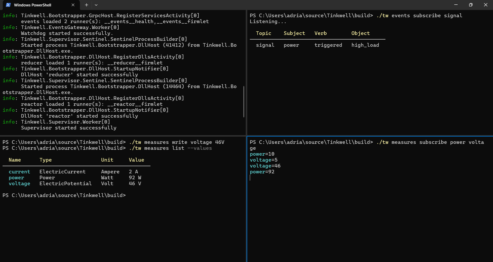

# Tinkwell

This repository is a work in progress and serves as an exploratory reference implementation for the IoT hub described in [IoT Architectures Under Pressure](https://dev.to/adriano-repetti/iot-architectures-under-pressure-why-implementation-isnt-as-simple-as-it-seems-part-1-3inn).

At this stage, the code is intended solely for **experimentation** with technical solutions: it is not production-ready, and both its structure and content may (should!) change drastically at any time.

See [Getting-Started.md](./Documentation/Getting-Started.md) for instructions.

## What for?

This project does not contain the entire implementation of a "firmware-less Hub" (the Wasm host and library, UI and firmware repository won't be included for sure). That's because it can be used for different purposes then each specific use-case is going to be a separate repository.

You can find a blog post at [Tinkwell: Firmware-less IoT and Lab Automation](https://dev.to/adriano-repetti/tinkwell-firmware-less-iot-and-lab-automation-2gef), here a tiny extract:

* **Lab automation**: each lab instrument (whether it’s a spectrometer, thermal controller, or motion stage) often comes with its own driver or control script. Tinkwell can supervise each of these as a separate (monitored) runner process. To add a new device is as simple as adding a new `runner` entry in the Ensamble file.
    * With the Store module, you can track sensor readings (voltages, temperatures, concentrations) using unit-aware types. You can log conditions, perform derived computations and broadcast changes.
    * You could define workflows where launching a new test involves spinning up a sequence of runners: data collector, logger, analyzer, etc. Since runners can be composed hierarchically (one runner invoking others), you can build robust pipelines for repeatable experiments.
    * Using gRPC-based discovery and command interfaces, external systems—or even human operators—can see what's running and monitor the progress of an experiment.
* **Edge and Fog Computing in industrial IoT**: factories increasingly rely on edge devices to perform localized processing (e.g. anomaly detection from vibration sensors, temperature thresholds for safety cutoffs). Tinkwell offers a lightweight, resilient orchestration layer that doesn’t need containers or a full Kubernetes cluster—perfect for rugged industrial PCs at the edge.
* **Test benches and automated QA stations**: like in labs, automated testing environments in industrial R&D departments often involve specialized hardware setups. Scripts or binaries controlling signal generators, power supplies, or data loggers can be isolated into runners. Ensamble files could represent test configurations, while the store tracks metrics such as voltage, temperature, or system throughput.

## Idea

A _system_ is composed of multiple _units_, each one dedicated to a specific task and it runs on its own isolated process. Units are launched by a _supervisor_ reading an _ensamble_ configuration file. Units communicates to each other using gRPC and they can find the available services through a _discovery_ service exposed by the supervisor.

The supervisor is in charge of launching and monitoring the health of all the units in the system but multiple sytems can cooperate in a _network_ and talk to each other without knowing where one specific is running.

Units should expose gRPC services but they should also support a "_file-like access_" to the resources they manage, this enables scripting through simple shell programs (and the shell itself can be a unit accepting HTTP POST requests for the script to execute, for example).

A minimal `ensamble.tw` configuration file looks like this:

```text
compose service orchestrator "Tinkwell.Orchestrator.dll"
compose agent watchdog "Tinkwell.Watchdog.dll"
compose service store "Tinkwell.Store.dll"
compose service events "Tinkwell.EventsGateway.dll"
compose agent reducer "Tinkwell.Reducer.dll" { path: "./config/measures.twm" }
compose agent reactor "Tinkwell.Reactor.dll" { path: "./config/measures.twm" }
```

If you have derived measures then you could define them like so:

```text
// This is just a constant, we can use it to simulate changes
measure voltage {
	type: "ElectricPotential"
	unit: "Volt"
	expression: "5"
}

measure current {
	type: "ElectricCurrent"
	unit: "Ampere"
	expression: "2"
}

// This is a derived measure, it's recalculated when its dependencies change
measure power {
	type: "Power"
	unit: "Watt"
	expression: "voltage * current"

    signal high_load {
      when: "power > 80"
      with {
        severity: "critical"
      }
    }

    signal low_load {
      when: "power < 10"
    }
}

signal low_battery {
  when: "voltage < 24 and current < 10"
  with {
    severity: "warning"
  }
}
```

That's enough to start experimenting, open a terminal and type this:

```bash
# This will check the configuration files in search of common mistakes
./tw ensamble lint ./ensamble.twm
./tw measures lint ./config/measures.twm
```

Now start the supervisor (`Tinkwell.Supervisor`) and wait until it's ready. In the first terminal type this:

```bash
# In this terminal you're going to see signals (alarms)
./tw events subscribe signal
```

In another terminal:

```bash
# In this terminal you're going to see when measures changed
./tw measures subscribe voltage power
```

In yet another terminal:

```bash
# This should cause a signal to be published!
./tw measures write voltage "46 V"
```

You should see something similar to this:



## More information

-   [Glossary](./Glossary.md): Understand the core concepts and terminology.
-   [CLI Reference](./CLI.md): Discover all the available commands for monitoring and debugging.
-   [Derived Measures](./Derived-measures.md): Learn how to create custom measures.

## What's Missing?

This code is just to explore an idea then, obviously, code quality has to vastly improve but there are a few bits that we surely need for an MVP:

* We have a VERY basic watchdog, now we need something to "act" on that. Broadcasting alerts/news? Running a local script? A new "host" that executes scripts based on events broadcasted through the alerts/news service (this could also work in tandem with alerts from the Trigger firmlet)
* A very simple web UI to manage the system, monitor its health, see logs and read measures (no dashboards for now!).
* Pluggable strategies (for example to select how to store measures, how to do load balancing when fetching a service by family name, etc).
* Update the store to support plain text data!!!
* All the other predefined runners/services described in the blog post!
