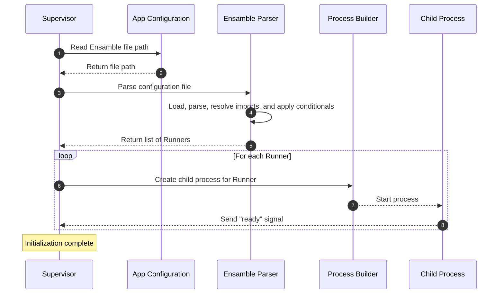
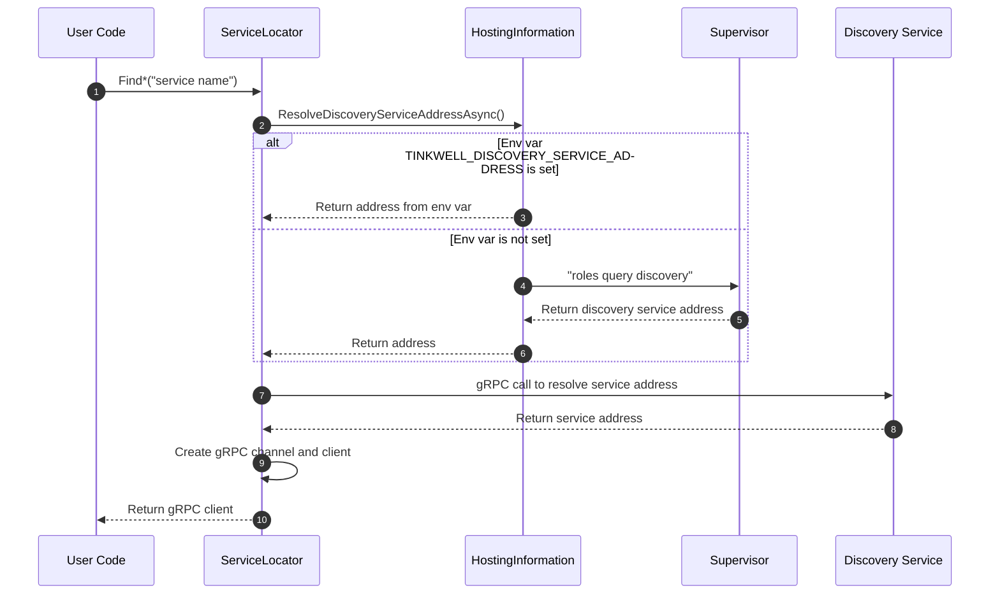

# Supervisor

The Supervisor is responsible for reading the ensamble configuration and spawning the required child processes (runners).

## Generic Loading Sequence

## Service Address Resolution

