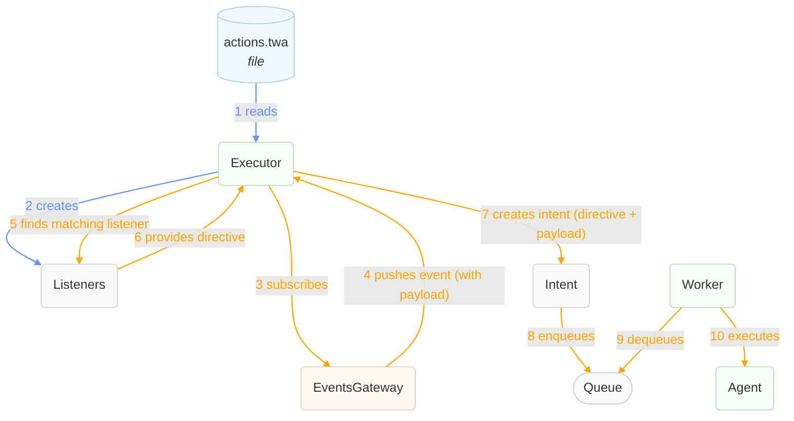
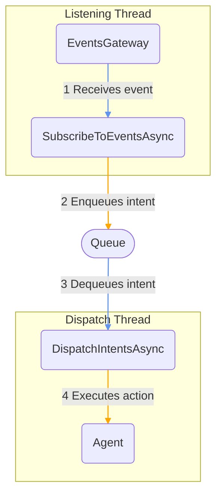

# Who is doing what?

There are many names bouncing around here, we should clarify a little bit!

**Definition** (`WhenDefinition`, `ActionDefinition`) : represents the configuration as read from a TWA file.
We do not keep them around: we just build the objects we need and discard them.

**Listener**: represents a single listener to a specific event (or set of them, according to the filters).
It also contains the list of things to do when such an event is received. They're called _directives_.

**Directive**: represents one thing to do in abstract terms, it contains the type of the agent to use and 
the parameters to pass to it (but still the way they were defined in configuration, it means that the actual values
calculated using the payload (specific of a received event) have not been used yet.

**Intent**: this is the final object that is put into the queue of things to do, it contains the type of the agent to use
and the parameters just like a `Directive`, but also the payload of the event that triggered it.
The worker thread will then create an agent and transform the parameters into their final value using the payload.
To understand this imagine a parameter defined as `path: $"/path/to/{{ payload.name }}"`,
the worker thread will transform that template string into the final value, like `"path/to/john"` if
`payload.name` was `"john"`.

**Agent**: represents the object in charge of performing an action, using the the parameters and the payload.

## Data Flow

## Enqueue/Dequeue Flow

