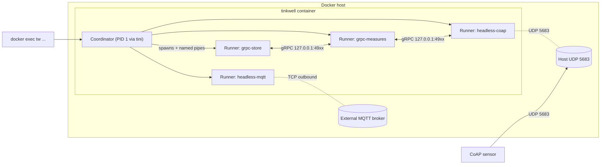

# Running Tinkwell under Docker

The Tinkwell project publishes an official Docker image at [`ghcr.io/arepetti/tinkwell`](https://github.com/arepetti/Tinkwell/pkgs/container/tinkwell). This page is a copy-pasteable walkthrough for running it on a server, an edge gateway, a CI environment, or your laptop. It assumes you are already familiar with the basics of `docker run` and `docker compose`.

If you need a managed daemon on a bare Linux host instead, see [Running under systemd](systemd.md).

## TL;DR

```bash
# Quick start: bind-mount your ensemble, publish your protocol port.
docker run --rm \
  -v "$PWD/ensemble.tw":/etc/tinkwell/ensemble.tw:ro \
  -p 5683:5683/udp \
  ghcr.io/arepetti/tinkwell:latest

# Inspect the running instance.
docker exec -it <container> tw status
```

## What ships, what you provide

The released image is **a runtime, not a deployment**. In every real project the ensemble configuration and the set of plugins are unique to the deployment and change over time, so they are explicitly **not** baked into the image.

| Provided by the image                                 | Provided by you                                                 |
| ----------------------------------------------------- | --------------------------------------------------------------- |
| Coordinator, runners, all first-party built-in runlets | `ensemble.tw` (and any `include`-d files)                       |
| `tw` CLI, entrypoint, healthcheck                     | Third-party plugins (see [plugins](../reference/plugins.md))    |
| .NET self-contained runtime, base OS, `tini` init     | Secrets: broker passwords, DB connection strings, TLS certs     |
| Volumes for `/etc/tinkwell` and `/var/lib/tinkwell`   | The choice of which protocol ports to publish                   |

Two supported usage patterns:

- **Pattern A — Bind-mount** ([below](#pattern-a--bind-mount-development--ci)). Use the image as-is and bind-mount your configuration. Best for development, CI, and short-lived experiments.
- **Pattern B — Derived image** ([below](#pattern-b--derived-image-production)). Build your own image `FROM ghcr.io/arepetti/tinkwell:<version>` with your ensemble + plugins included. Recommended for production: the resulting image is immutable, versioned, and can be deployed identically across environments.

A running container always looks the same internally regardless of which pattern you use:



The coordinator and all of its runners live inside the **same** container. This is required: they communicate over named pipes and loopback gRPC, both of which are local to the process namespace. Do **not** split coordinator and runners across multiple containers.

## Tags

The image is published on every Tinkwell release for `linux/amd64` and `linux/arm64`. The tag policy is:

| Tag           | Meaning                                                        |
| ------------- | -------------------------------------------------------------- |
| `0.8.0`       | A specific release. **Pin this in production.**                |
| `0.8`         | The latest patch in the `0.8.x` line.                          |
| `latest`      | The most recent release. Convenient for development; never pin in production. |

When pinning by digest (recommended for fully reproducible deployments) use `ghcr.io/arepetti/tinkwell@sha256:...`.

## Pattern A — Bind-mount (development / CI)

In this pattern you keep your `ensemble.tw` on the host filesystem and hand it to the container at runtime.

### Minimum example

Create an `ensemble.tw` next to your terminal session, then:

```bash
docker run --rm \
  --name tinkwell \
  -v "$PWD/ensemble.tw":/etc/tinkwell/ensemble.tw:ro \
  -p 5683:5683/udp \
  ghcr.io/arepetti/tinkwell:latest
```

The container starts the coordinator in the foreground; press `Ctrl-C` to stop it (SIGTERM is forwarded to `tw start`, which triggers the same graceful shutdown as `tw quit`).

### With includes

If your top-level `ensemble.tw` uses `include` to split configuration across files, mount the whole directory:

```bash
docker run --rm \
  --name tinkwell \
  -v "$PWD/config":/etc/tinkwell:ro \
  -p 5683:5683/udp \
  ghcr.io/arepetti/tinkwell:latest
```

Inside `ensemble.tw`, write include paths relative to `/etc/tinkwell/` or as absolute paths so they resolve correctly inside the container:

```text
include "/etc/tinkwell/include/measures.tw"
include "/etc/tinkwell/include/signals.tw"
```

### Plugins

Drop one or more plugin directories under a host folder following the `name@major.minor.patch` convention documented in the [plugins reference](../reference/plugins.md), then mount them:

```bash
docker run --rm \
  --name tinkwell \
  -v "$PWD/ensemble.tw":/etc/tinkwell/ensemble.tw:ro \
  -v "$PWD/plugins":/var/lib/tinkwell/plugins:ro \
  -p 5683:5683/udp \
  ghcr.io/arepetti/tinkwell:latest
```

The image sets `TINKWELL_PLUGIN_PATH=/var/lib/tinkwell/plugins` so anything you drop there is discovered automatically. See [Plugins inside the container](#plugins-inside-the-container) below for the lookup order.

### What happens when you forget the config

Running the image without an ensemble produces a deliberate, helpful error rather than a stack trace:

```text
$ docker run --rm ghcr.io/arepetti/tinkwell:latest
[tinkwell] No ensemble configuration found at: /etc/tinkwell/ensemble.tw

The Tinkwell image is a runtime only. You must provide your own
ensemble.tw, either by:

  1. Bind-mounting it into the container (development):

       docker run --rm \
         -v $PWD/ensemble.tw:/etc/tinkwell/ensemble.tw:ro \
         -p 5683:5683/udp \
         ghcr.io/arepetti/tinkwell:latest

  2. Building a derived image (production):

       FROM ghcr.io/arepetti/tinkwell:<version>
       COPY ensemble.tw /etc/tinkwell/ensemble.tw
       COPY plugins/    /var/lib/tinkwell/plugins/

To use a path other than /etc/tinkwell/ensemble.tw, set the
TINKWELL_CONFIG environment variable when starting the container.

See: https://github.com/arepetti/Tinkwell/blob/main/docs/getting-started/docker.md
```

The container exits with code **78** (`EX_CONFIG` from `sysexits.h`), which is distinguishable from an application crash.

## Pattern B — Derived image (production)

For production deployments, build your own image with the ensemble and plugins included. This produces an immutable artifact that can be versioned, signed, scanned, and rolled out like any other application image.

### Project layout

```text
my-tinkwell-deployment/
├── Dockerfile            (derived from the base image)
├── ensemble.tw           (your top-level ensemble)
├── include/              (optional files referenced by `include`)
│   ├── measures.tw
│   ├── signals.tw
│   └── actions.tw
└── plugins/              (optional third-party plugins)
    ├── my-runlet@1.0.0/
    │   └── My.Runlet.dll
    └── another-plugin@2.3.1/
        └── Another.Plugin.dll
```

### Dockerfile

A starting template is provided at [`packaging/docker/example/Dockerfile`](https://github.com/arepetti/Tinkwell/blob/main/packaging/docker/example/Dockerfile). The essentials are:

```dockerfile
ARG TINKWELL_VERSION=0.8.0
FROM ghcr.io/arepetti/tinkwell:${TINKWELL_VERSION}

COPY --chown=tinkwell:tinkwell ensemble.tw /etc/tinkwell/ensemble.tw
COPY --chown=tinkwell:tinkwell include/    /etc/tinkwell/include/
COPY --chown=tinkwell:tinkwell plugins/    /var/lib/tinkwell/plugins/
```

Build:

```bash
docker build \
  --build-arg TINKWELL_VERSION=0.8.0 \
  -t my-org/my-tinkwell:1.0 .
```

Always pin the base tag to an exact version. Using `latest` makes builds non-reproducible and means an upstream release could change runlet behavior without warning.

### Run

The base image already declares the entrypoint, healthcheck, user, and volumes. You only need to publish the protocol ports your ensemble uses:

```bash
docker run --rm \
  --name tinkwell \
  -p 5683:5683/udp \
  my-org/my-tinkwell:1.0
```

### Secrets

Do **not** `COPY` secrets into the image. Pass them at runtime via environment variables, Docker secrets, or Kubernetes secrets, and read them from your ensemble through Liquid preprocessing:

```text
mqtt prod-broker {
    host = "{{ env.MQTT_HOST }}"
    username = "{{ env.MQTT_USER }}"
    password = "{{ env.MQTT_PASS }}"
}
```

```bash
docker run --rm \
  -e MQTT_HOST=broker.example.com \
  -e MQTT_USER=ingest \
  -e MQTT_PASS_FILE=/run/secrets/mqtt \
  -v "$PWD/secrets/mqtt":/run/secrets/mqtt:ro \
  my-org/my-tinkwell:1.0
```

See the [configuration internals](../architecture/configuration-internals.md) page for the full preprocessing pipeline.

## Configuration inside the container

Tinkwell honours the standard ASP.NET Core configuration providers, with the entrypoint adding two container-specific environment variables on top.

| Source                                                | Example                                          | Notes                                                                          |
| ----------------------------------------------------- | ------------------------------------------------ | ------------------------------------------------------------------------------ |
| `TINKWELL_CONFIG`                                     | `TINKWELL_CONFIG=/etc/tinkwell/lab.tw`           | Overrides the ensemble path the entrypoint passes to `tw start`.               |
| `TINKWELL_PLUGIN_PATH`                                | `TINKWELL_PLUGIN_PATH=/srv/plugins`              | Highest-priority plugin search root (see [plugins](../reference/plugins.md)).   |
| Ensemble file                                         | `/etc/tinkwell/ensemble.tw`                      | The primary source of runtime configuration.                                   |
| `appsettings.json` baked into `Tinkwell.Coordinator`  | `/usr/lib/tinkwell/appsettings.json`             | Defaults shipped with the image.                                               |
| Environment variables (ASP.NET binding)               | `Telemetry__OtlpEndpoint=http://collector:4317`  | Keys use `__` instead of `:`. Override anything in `appsettings.json` this way. |

The most commonly overridden keys:

| Environment variable                                  | Effect                                                                                              |
| ----------------------------------------------------- | --------------------------------------------------------------------------------------------------- |
| `Telemetry__OtlpEndpoint`                             | Enables OpenTelemetry export to an OTLP collector (see [telemetry](../reference/telemetry.md)).      |
| `Coordinator__Endpoints__BasePort`                    | Changes the first port in the gRPC allocation range (default `4900`).                                |
| `Coordinator__Endpoints__PortRange`                   | Changes the size of the gRPC allocation range (default `100`).                                       |
| `Coordinator__PipeServer__PipeName`                   | Renames the control pipe (default `tinkwell-coordinator`). Useful if you run more than one container with a shared pipe namespace, but this is rarely needed. |
| `Coordinator__RestartPolicy__MaxRestartsInWindow`     | Tightens or relaxes the runner restart policy.                                                       |
| `Tls__Mode`, `Tls__CertificatePath`, `Tls__CertificatePassword` | Enables HTTPS on runner gRPC. See [HTTPS / TLS](#https--tls) below.                       |
| `Logging__LogLevel__Default`                          | Standard ASP.NET log-level override.                                                                 |

## Plugins inside the container

Plugins are discovered exactly as on bare metal — see the [plugins reference](../reference/plugins.md) for the full rules. Inside the container, the search roots resolve as follows:

| Priority | Source                                          | Path inside the container                    |
| -------- | ----------------------------------------------- | -------------------------------------------- |
| 1 (highest) | `TINKWELL_PLUGIN_PATH`                       | `/var/lib/tinkwell/plugins` (preset)         |
| 2        | `~/Tinkwell/plugins/`                           | `/var/lib/tinkwell/Tinkwell/plugins/`        |
| 3        | `${LocalApplicationData}/Tinkwell/plugins/`     | `/var/lib/tinkwell/.local/share/Tinkwell/plugins/` |
| 4 (lowest) | `${AppContext.BaseDirectory}/plugins/`        | `/usr/lib/tinkwell/plugins/`                 |

In practice, use either:

- **Bind-mount**: `-v "$PWD/plugins":/var/lib/tinkwell/plugins:ro`
- **Derived image**: `COPY plugins/ /var/lib/tinkwell/plugins/`

Both put plugins at priority 1.

Each plugin directory **must** be named `name@version` (for example `sensor-binding@2.0.0`). Anything else is skipped with a warning.

## Volumes

| Path inside container       | Purpose                                                                            | Required? |
| --------------------------- | ---------------------------------------------------------------------------------- | --------- |
| `/etc/tinkwell/`            | Ensemble configuration root. The entrypoint expects `ensemble.tw` here by default. | Yes       |
| `/var/lib/tinkwell/`        | Coordinator working directory. Runtime state lives here (event-persistence SQLite, store-as-sqlite, runtime caches, plugin sub-dirs). | Recommended (named volume) |
| `/var/lib/tinkwell/plugins/`| Drop-in plugin directory referenced by `TINKWELL_PLUGIN_PATH`.                     | Only if you use plugins |

The image declares `VOLUME ["/etc/tinkwell", "/var/lib/tinkwell"]` so Docker creates anonymous volumes for them if you don't provide your own. Always attach a named volume (or bind mount) to `/var/lib/tinkwell` in production so that state survives container recreation:

- **`event-persistence`** writes its SQLite database under `/var/lib/tinkwell/` by default (see [event-persistence](../architecture/runlets.md)).
- The **`store`** runlet, when configured with `storage = "sqlite"`, also persists to the working directory.
- The **`measure-history`** runlet does **not** write here — it streams to an external time-series database (see [Measure history with TimescaleDB](#measure-history-with-timescaledb) below).

## Ports

The gRPC control plane (`Coordinator:Endpoints:BasePort` and the following `PortRange` ports, default `4900-4999`) is **never published**. gRPC runners bind to the container's loopback by design — they form an internal mesh, not a public API. See [Networking caveats](#networking-caveats) below.

What you do publish depends entirely on which protocol runlets your ensemble enables. Common defaults:

| Runlet            | Protocol  | Default port (configurable in `.tw`) | Direction                                    |
| ----------------- | --------- | ------------------------------------ | -------------------------------------------- |
| `coap`            | UDP       | **5683**                             | Inbound (publish with `-p 5683:5683/udp`)    |
| `lwm2m`           | UDP       | **5683** (CoAP under the hood)       | Inbound (publish a different host port if it conflicts with `coap`) |
| `protobuf-gateway`| UDP       | **5684**                             | Inbound                                      |
| `mqtt-server`     | TCP       | **1883**                             | Inbound (development only; prefer a real broker) |
| `mqtt`            | TCP       | broker-defined (default 1883)        | **Outbound** — nothing to publish            |
| `modbus` (TCP)    | TCP       | slave-defined (default 502)          | **Outbound**                                 |
| `text-query` (TCP)| TCP       | instrument-defined (default 5025)    | **Outbound**                                 |
| `http-post` action| TCP       | URL-defined                          | **Outbound**                                 |
| Telemetry (OTLP)  | TCP/HTTP  | collector-defined (4317 / 4318)      | **Outbound**                                 |

Per-runlet specifics live in the reference pages ([CoAP](../reference/coap.md), [LwM2M](../reference/lwm2m.md), [MQTT](../reference/mqtt.md), [Modbus](../reference/modbus.md), [TextQuery](../reference/text-query.md), [protobuf gateway](../reference/protobuf-gateway.md), [telemetry](../reference/telemetry.md)).

### UDP vs TCP

Don't forget the `/udp` suffix for CoAP/LwM2M/protobuf-gateway. Without it, Docker maps a TCP port instead and the runlet appears unreachable even though `tw status` shows runners as `ready`.

## Healthcheck and signals

### Healthcheck

The image ships a `HEALTHCHECK` that runs `tw ping` every 30 seconds inside the container:

```text
HEALTHCHECK --interval=30s --timeout=5s --start-period=20s --retries=3
            CMD ["/usr/bin/tw", "ping"]
```

`tw ping` talks to the coordinator over the local named pipe and exits 0 when it gets a response. The healthcheck moves to `unhealthy` after three consecutive failures — typical when the coordinator has crashed or is still loading a very large ensemble.

You can inspect the current status with:

```bash
docker inspect --format='{{json .State.Health}}' tinkwell | jq .
```

To disable it (for example when using an external probe), pass `--no-healthcheck` to `docker run`, or override in compose:

```yaml
services:
  tinkwell:
    healthcheck:
      disable: true
```

### Signals

The entrypoint runs under [`tini`](https://github.com/krallin/tini) as PID 1 with `-g` (process-group mode). When Docker sends `SIGTERM` (`docker stop`, `docker compose down`, Kubernetes pod termination, etc.), `tini` forwards it to the entrypoint's process group, which reaches `tw start` and the coordinator. The coordinator then runs its normal graceful shutdown sequence — the same one `tw quit` invokes: each runner gets a `quit`, `IRunlet.StopAsync` runs in order, and the process tree exits cleanly.

Increase the default 10-second grace period if your ensemble has slow shutdown (e.g. flushing a large measure-history batch):

```bash
docker stop --time=30 tinkwell
```

```yaml
services:
  tinkwell:
    stop_grace_period: 30s
```

`SIGKILL` is sent after the grace period and skips graceful shutdown, so any in-flight database writes from `event-persistence` may be lost (this is a hard process termination, not a clean Tinkwell shutdown).

## Using the CLI

The `tw` CLI talks to the coordinator over the named pipe `tinkwell-coordinator`, which resolves to `/tmp/CoreFxPipe_tinkwell-coordinator` on Linux. Because the pipe is local to the container's mount namespace, the canonical way to use the CLI is `docker exec`:

```bash
docker exec -it tinkwell tw status
docker exec -it tinkwell tw measures list
docker exec -it tinkwell tw events watch
docker exec -it tinkwell tw services list
docker exec -it tinkwell tw quit                # graceful shutdown
```

Equivalent for compose:

```bash
docker compose exec tinkwell tw status
```

`tw` runs as the `tinkwell` user inside the container by default, which matches the user the coordinator runs under, so the named pipe is reachable without extra flags.

Avoid trying to reach the pipe from the host by mounting `/tmp` — the pipe path is also tied to the container's process namespace, so this is fragile and not supported. For programmatic remote control, use gRPC over the `protobuf-gateway` or expose a custom HTTP runlet instead.

## Networking caveats

### gRPC is loopback-only inside the container

`GrpcRunnerBuilder` listens on `127.0.0.1` and there is no built-in configuration switch to change that. As a consequence:

- **You cannot publish 4900-4999 and reach the gRPC services from outside.** Even with `-p 4900:4900` Docker can connect, but Kestrel is not listening on the container's external interface, so the connection is refused.
- This is intentional. gRPC carries the internal control plane (Store, Measures, Events, Signals, Measure History, …); it relies on the named-pipe authenticated service registry inside the container. Exposing it would require both binding to `0.0.0.0` and adding authentication / TLS. See [services internals](../architecture/services-internals.md) and [pipe security](../architecture/pipe-security.md).

If you need external read/write access to the data plane:

- Prefer the **`protobuf-gateway`** runlet ([reference](../reference/protobuf-gateway.md)), which tunnels selected gRPC services over CoAP and is meant to be exposed.
- Or write a small custom HTTP/REST runlet that wraps the methods you need and bind it to `IPAddress.Any` explicitly. Publish that runlet's port instead of 4900-4999.

### One coordinator per container

Coordinator-runner IPC uses named pipes and loopback TCP. Both are local to the container, so splitting a single Tinkwell ensemble across multiple containers does not work. The intended deployment unit is one coordinator (and all its runners) per container.

Running multiple **independent** Tinkwell ensembles on the same host is fine — each gets its own pipe namespace because each container has its own `/tmp`. If you ever need them to share a pipe namespace, set `Coordinator__PipeServer__PipeName` per instance.

### Host networking

`--network host` works on Linux and skips the bridge entirely. The container then sees the host's `127.0.0.1`, so the gRPC services become reachable from anything on the host (still **not** from another machine, since they still bind to loopback). This mode is occasionally useful for testing but loses port isolation; the default bridge networking with explicit `-p` is recommended for most use cases.

## HTTPS / TLS

The coordinator does not serve gRPC and needs no certificate. Each gRPC **runner** can serve HTTPS by setting the `Tls` section in configuration (see [HTTPS / TLS reference](../reference/https.md) for the full options).

Because each runner is a separate process inside the container, they all read the same `appsettings.json` and the same environment variables, so a single set of env vars or a single mounted certificate applies to all of them:

```bash
docker run --rm \
  -v "$PWD/ensemble.tw":/etc/tinkwell/ensemble.tw:ro \
  -v "$PWD/certs/tinkwell.pfx":/etc/tinkwell/tinkwell.pfx:ro \
  -e Tls__Mode=SelfSigned \
  -e Tls__CertificatePath=/etc/tinkwell/tinkwell.pfx \
  -e Tls__CertificatePassword="$(cat ./certs/tinkwell.pfx.pwd)" \
  -p 5683:5683/udp \
  ghcr.io/arepetti/tinkwell:latest
```

Keep in mind that this only changes the **internal** gRPC scheme to `https`; it does not make 4900-4999 reachable from outside the container — that limitation is separate from TLS.

## Docker Compose

The project ships a runnable sample at [`packaging/docker/docker-compose.yml`](https://github.com/arepetti/Tinkwell/blob/main/packaging/docker/docker-compose.yml). The minimum useful version is:

```yaml
services:
  tinkwell:
    image: ghcr.io/arepetti/tinkwell:0.8.0
    container_name: tinkwell
    restart: unless-stopped
    volumes:
      - ./ensemble.tw:/etc/tinkwell/ensemble.tw:ro
      - tinkwell-state:/var/lib/tinkwell
    ports:
      - "5683:5683/udp"

volumes:
  tinkwell-state:
```

Start it from a directory that contains your `ensemble.tw`:

```bash
docker compose up -d
docker compose exec tinkwell tw status
docker compose logs -f tinkwell
docker compose down
```

The sample file in the repo also includes commented-out blocks for TimescaleDB and the Aspire Dashboard. Uncomment them when you turn on the corresponding runlets.

## Measure history with TimescaleDB

The `measure-history` runlet streams measure changes into a time-series database. The reference backend ([`Tinkwell.Measures.History.TimescaleDb`](../reference/measure-history.md)) talks to a TimescaleDB instance, which is straightforward to add as a compose sidecar:

```yaml
services:
  tinkwell:
    image: ghcr.io/arepetti/tinkwell:0.8.0
    depends_on:
      timescaledb:
        condition: service_healthy
    volumes:
      - ./ensemble.tw:/etc/tinkwell/ensemble.tw:ro
      - tinkwell-state:/var/lib/tinkwell
    ports:
      - "5683:5683/udp"

  timescaledb:
    image: timescale/timescaledb:latest-pg16
    environment:
      POSTGRES_DB: tinkwell
      POSTGRES_USER: tinkwell
      POSTGRES_PASSWORD: change-me
    volumes:
      - tinkwell-timescale:/var/lib/postgresql/data
    healthcheck:
      test: ["CMD-SHELL", "pg_isready -U tinkwell -d tinkwell"]
      interval: 10s
      timeout: 5s
      retries: 6

volumes:
  tinkwell-state:
  tinkwell-timescale:
```

The measure-history block in `ensemble.tw` then points at the sidecar:

```text
runner measure-history-host from "Tinkwell.Runner.Grpc.dll" {
    runlet measure-history from "Tinkwell.Runlet.MeasureHistory.dll" {
        backend = "Tinkwell.Measures.History.TimescaleDb"
        connection-string = "Host=timescaledb;Database=tinkwell;Username=tinkwell;Password=change-me"
    }
}
```

Move the password to a Docker secret or environment variable in production (see [Secrets](#secrets)).

## Telemetry

Setting `Telemetry__OtlpEndpoint` enables OTLP export to any compatible collector. For a local-only view, the [.NET Aspire Dashboard](https://learn.microsoft.com/en-us/dotnet/aspire/fundamentals/dashboard/overview) is a single-container OTLP receiver and UI:

```yaml
services:
  tinkwell:
    image: ghcr.io/arepetti/tinkwell:0.8.0
    environment:
      Telemetry__OtlpEndpoint: http://aspire-dashboard:18889
    volumes:
      - ./ensemble.tw:/etc/tinkwell/ensemble.tw:ro
    ports:
      - "5683:5683/udp"

  aspire-dashboard:
    image: mcr.microsoft.com/dotnet/aspire-dashboard:latest
    environment:
      DOTNET_DASHBOARD_UNSECURED_ALLOW_ANONYMOUS: "true"
    ports:
      - "18888:18888"
      - "18889:18889"
```

Open `http://localhost:18888` in a browser to see traces, metrics, and structured logs. See the [telemetry reference](../reference/telemetry.md) for the catalog of emitted meters, counters, and histograms.

## Logs

Tinkwell writes logs to stdout/stderr; Docker captures them through its configured logging driver. Useful commands:

```bash
docker logs -f tinkwell                          # follow live
docker logs --tail 200 tinkwell                  # last 200 lines
docker logs --since 10m tinkwell                 # last 10 minutes
docker compose logs -f tinkwell                  # compose equivalent
```

In production, configure a long-term sink (`json-file` with rotation, or `journald` / `awslogs` / `fluentd`) in the daemon or per-container.

You can override Tinkwell's own log level without rebuilding the image:

```bash
docker run --rm \
  -e Logging__LogLevel__Default=Debug \
  -v "$PWD/ensemble.tw":/etc/tinkwell/ensemble.tw:ro \
  ghcr.io/arepetti/tinkwell:latest
```

## Updating

Pull the new image and recreate the container; the named volume keeps state across versions:

```bash
docker compose pull
docker compose up -d
```

Tinkwell follows semver in the `0.x` series (see the stability note in [`CHANGELOG.md`](../../CHANGELOG.md)); always read the changelog before moving to a new minor version because `.tw` syntax may change.

## Building the image locally

You usually don't need to: the published image is identical to a local build of the same commit. When you do want to build it (to test a local change before opening a PR, or to bake a custom runlet into the runtime), run from the repo root:

```bash
docker build \
  --build-arg VERSION=0.8.0-dev \
  -f packaging/docker/Dockerfile \
  -t tinkwell:dev .
```

For multi-arch:

```bash
docker buildx create --use --name tinkwell-builder
docker buildx build \
  --platform linux/amd64,linux/arm64 \
  --build-arg VERSION=0.8.0-dev \
  -f packaging/docker/Dockerfile \
  -t tinkwell:dev .
```

The build runs `dotnet publish Tinkwell.slnx -c Release -r linux-<arch> --self-contained`, so it does not need .NET installed on the host — just Docker and buildx.

## Troubleshooting

### `EX_CONFIG` exit (78), entrypoint error message

Cause: no `ensemble.tw` mounted at `/etc/tinkwell/ensemble.tw`. See [What happens when you forget the config](#what-happens-when-you-forget-the-config).

Fix: bind-mount the file (Pattern A) or build a derived image (Pattern B).

### Healthcheck stuck at `starting`

Cause: the coordinator is still loading runners — the default `start-period` is 20 seconds. A very large ensemble or a slow disk can exceed it.

Fix: override the healthcheck with a longer start period:

```yaml
services:
  tinkwell:
    healthcheck:
      test: ["CMD", "/usr/bin/tw", "ping"]
      interval: 30s
      timeout: 5s
      start_period: 120s
      retries: 3
```

### `tw ping` from the host fails

Expected — the pipe lives in the container's namespace. Use `docker exec tinkwell tw ping` instead, or `docker compose exec tinkwell tw ping`.

### A protocol port appears to be unreachable

Most common causes:

- Forgot the `/udp` suffix in `-p 5683:5683`. CoAP/LwM2M/protobuf-gateway are UDP-only.
- The host firewall is blocking the port. Check `iptables`, `ufw`, or your cloud provider's security group.
- A different process on the host is already bound to the published port. `docker run` will fail to start with an "address already in use" error in that case; check the daemon logs.
- The runlet is configured to use a non-default `port` in the ensemble; publish the configured port, not the default.

### Permission denied on `/var/lib/tinkwell` from a bind mount

The container runs as UID/GID `1000:1000`. If your host directory is owned by a different user, fix the ownership:

```bash
sudo chown -R 1000:1000 ./state
```

Or run the container as your own UID (loses the non-root hardening, so prefer the first option):

```bash
docker run --rm --user "$(id -u):$(id -g)" ...
```

### Coordinator crashes immediately with a parser error

Tinkwell parses `ensemble.tw` lazily on startup; syntax errors surface in the container logs at startup. Validate the file locally before mounting:

```bash
tw start --dry-run ensemble.tw     # if tw is installed on the host
```

Or run the parser inside the container with the same flag.

### Plugin not picked up

Check the plugin directory name. It must match `name@version` exactly (see [plugins reference](../reference/plugins.md)). Run

```bash
docker exec -it tinkwell tw info --verbose
```

to see the plugin roots Tinkwell scans and which entries it found.

### `Tls__CertificatePassword` not picked up

The password value is read as-is from the environment. If your password contains shell metacharacters, quote it carefully or pass it via a file:

```bash
docker run --rm \
  -v ./certs:/certs:ro \
  -e Tls__Mode=SelfSigned \
  -e Tls__CertificatePath=/certs/tinkwell.pfx \
  -e "Tls__CertificatePassword=$(cat ./certs/tinkwell.pfx.pwd)" \
  ghcr.io/arepetti/tinkwell:latest
```

## Limitations

- **gRPC services are not exposed.** See [Networking caveats](#networking-caveats).
- **`mqtt-server` is for development only.** Use a real broker (Mosquitto, EMQX, HiveMQ, the Aspire Dashboard's bundled broker, …) for anything beyond a single-host playground.
- **`measure-history`** requires an external database; the runlet only stores indices and SQL state via the configured backend. The image does not include TimescaleDB.
- **The CLI cannot be reached from the host machine.** Use `docker exec`. There is no remote HTTP control plane today.
- **Linux containers only.** Windows containers are not produced by the release pipeline. (The Windows release artifacts are native binaries, not containers.)

## See also

- [Coordinator-runner model](../architecture/coordinator-runner.md)
- [Runner lifecycle](../architecture/runner-lifecycle.md)
- [Named-pipe security](../architecture/pipe-security.md)
- [Services internals](../architecture/services-internals.md)
- [Plugins](../reference/plugins.md)
- [Measure history](../reference/measure-history.md)
- [Telemetry](../reference/telemetry.md)
- [HTTPS / TLS](../reference/https.md)
- [Running under systemd](systemd.md) — the bare-metal equivalent
